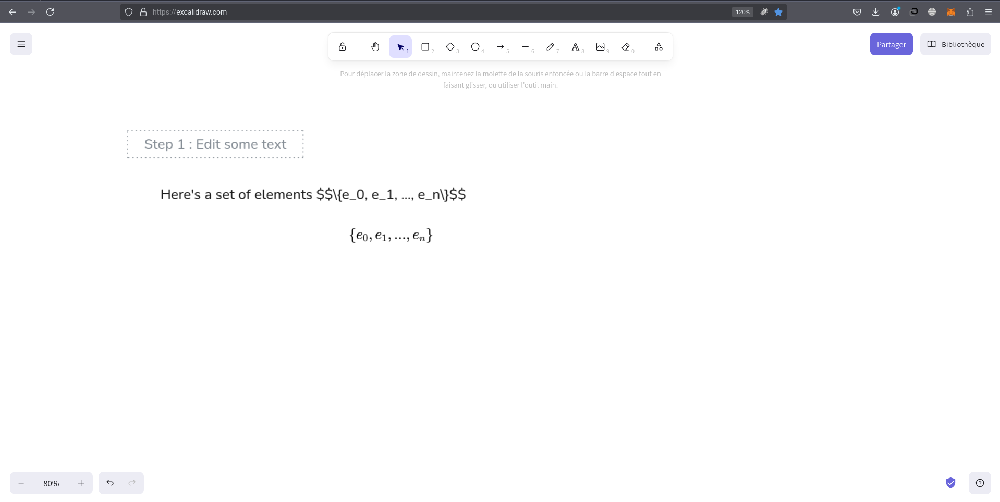
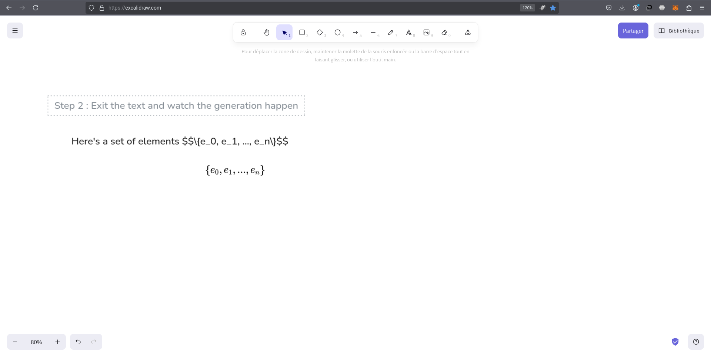

# ✏️ Excalidraw LaTeX Helper

Render LaTeX equations directly inside [Excalidraw](https://excalidraw.com) by simply typing them in your text elements using `$$...$$` syntax. This browser extension automatically detects LaTeX blocks and pastes rendered math as images on the canvas — as if by magic ✨

---

## 🧠 Features

- 📐 Type LaTeX directly in Excalidraw using `$$E = mc^2$$`
- 🔍 Automatically detects LaTeX when you leave a text field
- 🖼 Renders formulas using [KaTeX](https://katex.org)
- 🖌 Pastes math as a high-quality image directly into the canvas
- 💡 Supports multiple equations per text field
- 💻 Works locally — no internet calls or tracking

---

## 🚀 Getting Started

### 🧪 Manual Installation

1. Clone or [Download this repository as ZIP](https://github.com/your-repo-link)
2. Go to `chrome://extensions` (or `about:addons` on Firefox)
3. Enable **Developer Mode**
4. Click **Load unpacked**
5. Select the root folder of this extension

> ✅ Now open [Excalidraw](https://excalidraw.com) and try it out!

---

## ✍️ How To Use

1. Create a new text field in Excalidraw
2. Type a LaTeX expression like:

$$
E = mc^2
$$

3. Click outside the text box
4. The rendered equation appears as an image!

---

## 🛡 Privacy & Permissions

This extension **only requests access to `https://excalidraw.com/*`** in order to:
- Monitor for LaTeX expressions in text editors
- Insert the rendered math into the canvas

No tracking, telemetry, or remote requests are used.  
Everything is rendered locally in your browser.

---

## 🧩 Supported Browsers

- ✅ Chrome (requires installation via Chrome Web Store or Developer Mode)
- ✅ Firefox (supports via Add-ons or Developer install)

---

## 📸 Screenshots

*Typing LaTeX inside a text element*

*Pasted math image appears on canvas*

---

## 📥 Want to Publish or Contribute?

Feel free to fork, submit PRs, or open issues!

> This extension is open source and made for the community.

---

## 🔗 Links

- 📄 [Excalidraw](https://excalidraw.com)
- 📚 [KaTeX](https://katex.org/)
- ✍️ Created with ❤️ by [Your Name](https://github.com/yourname)

---

## 📃 License

MIT — do what you want, just don't claim it as your own without credit.

